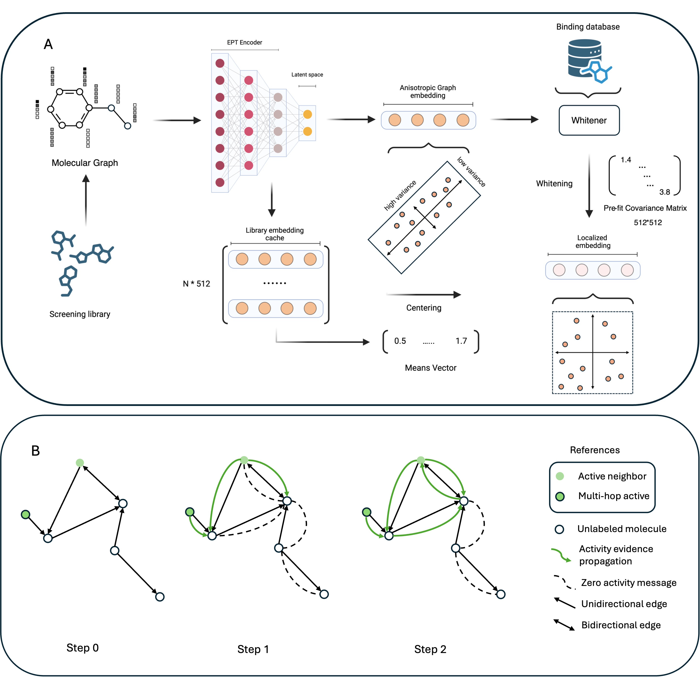

# TACTIVS

## Overview

**TACTIVS** is a ligand-based transductive inference framework that conditions
a frozen molecular representation directly at test time for flexible,
target-specific virtual screening. Starting from a small pool of known active
molecules, TACTIVS combines target-local centering, covariance whitening,
direct reference similarity, and graph propagation to rank an unlabeled
molecular library without target-specific model training.

<div align="center">

</div>

## Installation

```bash
conda env create -f environment.yml
conda activate tactivs
```

Download the published EPT epoch-49 checkpoint from the
[EPT pretrained checkpoint folder](https://drive.google.com/drive/folders/1ISCsnXss6YueYUvAIiR4wpm3k0TGjb44)
and pass it with `--encoder-checkpoint`.

## Input Format

Candidate libraries and external reference pools use the same CSV format:

```csv
parent_molecule_id,canonical_smiles
molecule_1,CCO
molecule_2,CCN
```

SDF and MOL files are also accepted. For SDF input, the molecule title is used
as `parent_molecule_id`.

## User Inference

First encode the candidate library:

```bash
python tactivs.py build-cache \
  --molecules candidates.csv \
  --output cache/my_target \
  --target MY_TARGET \
  --encoder-checkpoint /path/to/EPT.ckpt \
  --conformers 10
```

For a library with more molecules than the EPT embedding dimension, fit a
library-specific covariance whitener from the cache:

```bash
python tactivs.py fit-whitener \
  --cache cache/my_target \
  --output cache/my_target_whitener.npz
```

EPT embeddings have 512 dimensions, so this command requires at least 513
molecules. The library mean is used to estimate the covariance but is not saved;
inference recomputes the target-local mean after combining candidates and
references. For smaller libraries, use the released PDBscreen whitener.

Encode the known actives as the reference pool:

```bash
python tactivs.py build-reference-pool \
  --molecules known_actives.csv \
  --output cache/my_target_references.npz \
  --encoder-checkpoint /path/to/EPT.ckpt \
  --conformers 10
```

Run inference:

```bash
python tactivs.py infer \
  --cache cache/my_target \
  --whitener cache/my_target_whitener.npz \
  --target MY_TARGET \
  --reference-pool cache/my_target_references.npz \
  --theta final.json \
  --output ranking.csv
```

The released PDBscreen whitener can be used instead of a library-specific
whitener. Candidate and reference embeddings are combined before target-local
centering and whitening. Reference molecules are excluded from the output.
`ranking.csv` contains `parent_molecule_id`, `score`, `similarity`, `direct`,
and `graph`; no benchmark metrics are calculated in this path.

## Benchmark Reproduction

The released benchmark cache contains both active and inactive molecules with
labels. For every episode, its selected active molecules form the reference
pool, and all remaining molecules in the episode are ranked by the same
inference path used above. Labels are read again only after ranking to calculate
metrics.

```bash
python tactivs.py benchmark \
  --data-root /path/to/tactivs_data \
  --benchmark truedecoy \
  --split series-disjoint \
  --seed 0 \
  --k 5 \
  --theta final.json \
  --output-dir runs/truedecoy-series-k5
```

TrueDecoy and RandomDecoy support `molecule-random` and `series-disjoint`.
LIT-PCBA supports `molecule-random` and `ave`. `--k` is required and `--seed`
defaults to 0. Each target is written to
`<output-dir>/<target_id>/seed_<seed>/`, containing `summary.csv` and
`scores.csv`.

The benchmark data layout is:

```text
tactivs_data/
  truedecoy/
    ept/index.npz
    ept/embeddings/
    whitener.npz
    splits/
  randomdecoy/
  litpcba/
```

## Acknowledgements

TACTIVS is built on the [Equivariant Pretrained Transformer
(EPT)](https://doi.org/10.1038/s41467-026-69185-7). We thank Rui Jiao,
Xiangzhe Kong, Li Zhang, Ziyang Yu, Fangyuan Ren, Wenjuan Tan, Wenbing Huang,
and Yang Liu for developing EPT. The minimal EPT inference components required
by TACTIVS are included in `src/tactivs/_vendor/ept` under the original
upstream license.
